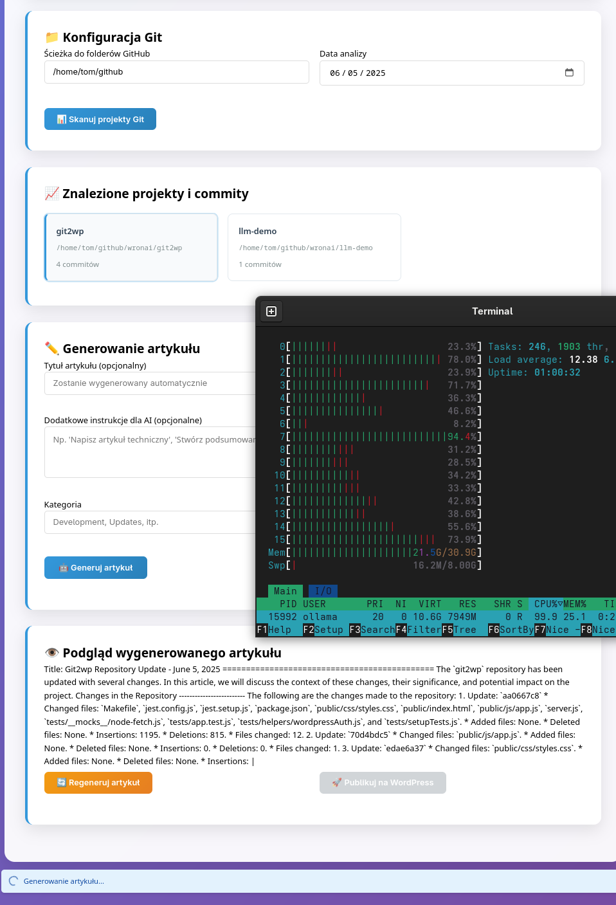

# WordPress Git Publisher 🚀

[](https://opensource.org/licenses/MIT)
[](https://nodejs.org/)
[](http://makeapullrequest.com)

Automatically generate and publish WordPress articles based on Git activity using AI (Ollama).

> **Note:** This README is also available in [Polish](#polski) below.

## Table of Contents
- [✨ Features](#-features)
- [🚀 Quick Start](#-quick-start)
- [⚙️ Configuration](#%EF%B8%8F-configuration)
- [🛠️ Requirements](#%EF%B8%8F-requirements)
- [📦 Installation](#-installation)
- [🔧 Usage](#-usage)
- [📁 Project Structure](#-project-structure)
- [🤝 Contributing](#-contributing)
- [📄 License](#-license)

## ✨ Features

- 📁 **Git Repository Scanning** - Automatically detect projects in `github/*/*` structure
- 🤖 **AI Article Generation** - Utilizes Ollama with support for Mistral 7B, Llama2, CodeLlama
- 📝 **WordPress Publishing** - Direct publishing via WordPress REST API
- 🎯 **Commit Analysis** - Detailed analysis of code changes for the selected day
- 📊 **Content Preview** - Preview articles before publishing
- 🔐 **Secure Authorization** - WordPress Application Passwords support
- 🚀 **Easy Setup** - Simple configuration via `.env` file
- 🔄 **Auto-Reload** - Development mode with automatic server restart

## 🚀 Quick Start

### Using Docker (Recommended)

1. **Clone the repository**
   ```bash
   git clone https://github.com/your-username/wordpress-git-publisher.git
   cd wordpress-git-publisher
   ```

2. **Configure environment**
   ```bash
   cp .env.example .env
   # Edit .env with your WordPress credentials and other settings
   ```

3. **Start with Docker Compose**
   ```bash
   docker compose up -d
   ```

4. **Access the web interface**
   ```
   http://localhost:9000
   ```

### Manual Installation

1. **Clone and install dependencies**
   ```bash
   git clone https://github.com/your-username/wordpress-git-publisher.git
   cd wordpress-git-publisher
   make install
   ```

2. **Configure environment**
   ```bash
   cp .env.example .env
   # Edit .env with your configuration
   ```

3. **Start the application**
   ```bash
   make start
   ```

## 📦 What's New in v1.1.0

- Added support for environment variables via `.env` file
- New `start.sh` and `stop.sh` scripts for easier service management
- Updated Makefile with better development environment support
- Improved error handling and logging
- Automatic configuration detection from `.env` file

## 🔧 Usage

### Starting Services

1. **Using Docker Compose (Recommended)**
   ```bash
   # Start all services
   docker compose up -d

   # View logs
   docker compose logs -f

   # Stop services
   docker compose down
   ```

2. **Using Make (Manual Installation)**
   ```bash
   # Start all services
   make start

   # Start frontend only
   make frontend

   # Start backend only
   make backend
   ```

### Publishing Articles

1. **Configure WordPress Settings**
   - Open `http://localhost:9000/settings.html`
   - Enter your WordPress URL, username, and application password
   - Configure Ollama settings (default URL: http://localhost:11434)
   - Save the configuration

2. **Scan Git Repositories**
   - Open `http://localhost:9000`
   - The app will scan for Git repositories in the `github/*/*` structure
   - Select a repository from the dropdown

3. **Generate and Publish Articles**
   - Choose a date to analyze Git activity
   - Click "Generate" to create an article using AI
   - Preview and edit the content if needed
   - Click "Publish" to post to WordPress

4. **Monitor Status**
   - Check frontend health at `http://localhost:9000/health`
   - Check backend health at `http://localhost:3001/api/health`
   - View logs in the `logs` directory
   - Review and click "Publish" to post to WordPress

2. **Via Command Line**
   ```bash
   # Replace YYYY-MM-DD with your target date
   make publish date=YYYY-MM-DD
   ```
   Example:
   ```bash
   make publish date=2025-06-05
   ```

### Monitoring

- **Frontend Logs**: Available at `logs/frontend.log`
- **Backend Logs**: Available at `logs/backend.log`
- **Health Checks**:
  - Frontend: `http://localhost:9000/health`
  - Backend: `http://localhost:3001/api/health`

## ⚙️ Configuration

### Environment Variables

Copy `.env.example` to `.env` and update the values:

```bash
cp .env.example .env
nano .env  # or use your preferred text editor
```

### Required Environment Variables

```env
# Server Configuration
PORT=3001
NODE_ENV=development

# Frontend Configuration
FRONTEND_PORT=8088
API_URL=http://localhost:3001

# WordPress Configuration
WORDPRESS_URL=https://your-wordpress-site.com
WORDPRESS_USERNAME=your_username
WORDPRESS_PASSWORD=your_application_password

# Ollama Configuration
OLLAMA_BASE_URL=http://localhost:11434
DEFAULT_MODEL=mistral:7b

# Git Configuration
GIT_SCAN_DEPTH=3
GIT_PATH=/path/to/your/repositories

# Logging
LOG_LEVEL=debug
LOG_FILE=logs/app.log
```

## 🛠️ Requirements

### Software
- **Node.js** >= 16.0.0
- **npm** >= 8.0.0
- **Git** installed and configured
- **Ollama** with a supported AI model

### Services
- **WordPress** with REST API enabled
- **Application Password** configured in WordPress

## ⚙️ Konfiguracja

### Plik .env

Skopiuj plik `.env.example` do `.env` i zaktualizuj wartości:

```bash
cp .env.example .env
nano .env  # lub inny edytor tekstu
```

### Wymagane zmienne środowiskowe

```env
# Server Configuration
PORT=3001
NODE_ENV=development

# Frontend Configuration
FRONTEND_PORT=8088
API_URL=http://localhost:3001

# WordPress Configuration
WORDPRESS_URL=https://twoja-strona.com
WORDPRESS_USERNAME=twoj_uzytkownik
WORDPRESS_PASSWORD=twoje_haslo_lub_application_password

# Ollama Configuration
OLLAMA_BASE_URL=http://localhost:11437
DEFAULT_MODEL=mistral:7b

# Git Configuration
GIT_SCAN_DEPTH=3
GIT_PATH=/sciezka/do/twoich/repozytoriow

# Logging
LOG_LEVEL=debug
LOG_FILE=logs/app.log
```

## 🛠️ Wymagania

### Oprogramowanie
- **Node.js** >= 16.0.0
- **npm** >= 8.0.0
- **Git** zainstalowany i skonfigurowany
- **Ollama** z wybranym modelem AI

### Usługi
- **WordPress** z włączonym REST API
- **Application Password** skonfigurowane w WordPress


## 📦 Installation

### 1. Clone the repository
```bash
git clone https://github.com/your-username/wordpress-git-publisher.git
cd wordpress-git-publisher
```

### 2. Install dependencies
```bash
make install
# or
npm install
```

### 3. Configure Ollama

#### Install Ollama
```bash
# Linux/macOS
curl -fsSL https://ollama.ai/install.sh | sh

# Or download from https://ollama.ai/download for Windows

# Start Ollama
ollama serve

# Download a model (in a separate terminal)
ollama pull mistral:7b
```

### 4. WordPress Configuration

#### Generate Application Password:
1. Log in to WordPress Admin
2. Go to **Users → Your Profile**
3. Scroll down to the **Application Passwords** section
4. Enter a name for your application (e.g., "Git Publisher")
5. Click **Add New Application Password**
6. **Copy the generated password** (it will only be shown once!)

## 🔧 Usage

### Available Commands

```bash
# Install dependencies
make install

# Start the application
make start

# Stop the application
make stop

# Restart the application
make restart

# Start in development mode with auto-reload
make dev

# Clean up temporary files
make clean

# Remove node_modules and logs
make distclean

# Show help
make help
```

### Web Interface

1. **WordPress Configuration**
   - **WordPress URL**: `https://your-wordpress-site.com`
   - **Username**: Your WordPress username
   - **Application Password**: The password generated in the WordPress settings
   - Click **"Test Connection"**

2. **Ollama Configuration**
   - **Ollama URL**: `http://localhost:11434` (default)
   - **Model**: Select an available model (e.g., `mistral:7b`)
   - Click **"Test Ollama"**

3. **Git Configuration**
   - **GitHub Folders Path**: `/path/to/your/github/repos` or `C:\Users\username\github`
   - **Analysis Date**: Select a date (defaults to today)
   - Click **"Scan Git Projects"**

4. **Generate Article**
   - Optionally provide a custom title
   - **Category**: WordPress category name
   - **Tags**: Comma-separated tags
   - Click **"Generate and Publish Article"**

5. **Publish**
   - Review the generated article in the preview section
   - Click **"Publish to WordPress"**
   - You'll receive a link to the published article

## 📋 Instrukcja użytkowania

### 1. Konfiguracja WordPress
- **URL WordPress**: `https://twoja-domena.com`
- **Nazwa użytkownika**: Twoja nazwa użytkownika WP
- **Application Password**: Hasło wygenerowane w kroku 4
- Kliknij **"Testuj połączenie"**

### 2. Konfiguracja Ollama
- **URL Ollama**: `http://localhost:11434` (domyślne)
- **Model**: Wybierz dostępny model (np. `mistral:7b`)
- Kliknij **"Testuj Ollama"**

### 3. Konfiguracja Git
- **Ścieżka do folderów GitHub**: `/home/user/github` lub `C:\Users\user\github`
- **Data analizy**: Wybierz datę (domyślnie dzisiaj)
- Kliknij **"Skanuj projekty Git"**

### 4. Generowanie artykułu
- **Opcjonalnie**: Podaj własny tytuł artykułu
- **Kategoria**: Nazwa kategorii WordPress
- **Tagi**: Tagi oddzielone przecinkami
- Kliknij **"Generuj i publikuj artykuł"**

### 5. Publikacja
- Przejrzyj wygenerowany artykuł w sekcji podglądu
- Kliknij **"Publikuj na WordPress"**
- Otrzymasz link do opublikowanego artykułu

## 📁 Project Structure

```
wordpress-git-publisher/
├── server.js              # Backend Express.js
├── package.json           # Node.js dependencies
├── package-lock.json      # Lock file for dependencies
├── public/                # Frontend assets
│   ├── css/
│   │   └── styles.css    # Frontend styles
│   ├── js/
│   │   └── app.js       # Frontend JavaScript
│   └── index.html         # Frontend application
├── logs/                  # Application logs
├── .env.example          # Example environment variables
├── .gitignore            # Git ignore rules
├── Makefile              # Development tasks
├── start.sh              # Startup script
├── stop.sh               # Shutdown script
└── README.md             # This documentation
```

## 🤝 Contributing

Contributions are welcome! Please feel free to submit a Pull Request.

1. Fork the repository
2. Create your feature branch (`git checkout -b feature/AmazingFeature`)
3. Commit your changes (`git commit -m 'Add some AmazingFeature'`)
4. Push to the branch (`git push origin feature/AmazingFeature`)
5. Open a Pull Request

## 📄 License

This project is licensed under the MIT License - see the [LICENSE](LICENSE) file for details.

---

# Polski

## ✨ Funkcje

- 📁 **Skanowanie repozytoriów Git** - Automatyczne wykrywanie projektów w strukturze `github/*/*`
- 🤖 **Generowanie artykułów AI** - Wykorzystanie Ollama z modelami Mistral 7B, Llama2, CodeLlama
- 📝 **Publikacja na WordPress** - Bezpośrednie publikowanie przez WordPress REST API
- 🎯 **Analiza commitów** - Szczegółowa analiza zmian w kodzie z danego dnia
- 📊 **Podgląd treści** - Możliwość przejrzenia artykułu przed publikacją
- 🔐 **Bezpieczna autoryzacja** - Wsparcie dla Application Passwords WordPress
- 🚀 **Łatwa konfiguracja** - Prosta konfiguracja przez plik `.env`
- 🔄 **Automatyczne przeładowanie** - Tryb developerski z automatycznym restartem serwera

## 🚀 Szybki start

1. **Sklonuj repozytorium**
   ```bash
   git clone https://github.com/your-username/wordpress-git-publisher.git
   cd wordpress-git-publisher
   ```

2. **Zainstaluj zależności**
   ```bash
   make install
   ```

3. **Skonfiguruj środowisko**
   ```bash
   cp .env.example .env
   # Edytuj plik .env zgodnie z konfiguracją
   ```

4. **Uruchom aplikację**
   ```bash
   make start
   ```

5. **Otwórz interfejs w przeglądarce**
   ```
   http://localhost:3001
   ```

## 🔧 Użycie

### Dostępne komendy

```bash
# Instalacja zależności
make install

# Uruchomienie aplikacji
make start

# Zatrzymanie aplikacji
make stop

# Restart aplikacji
make restart

# Uruchomienie w trybie developerskim z automatycznym przeładowywaniem
make dev

# Czyszczenie plików tymczasowych
make clean

# Usunięcie node_modules i logów
make distclean

# Wyświetlenie pomocy
make help
```

## 📄 Licencja

Ten projekt jest dostępny na licencji MIT - szczegóły w pliku [LICENSE](LICENSE).

## 🔧 API Endpoints

| Endpoint | Method | Description |
|----------|--------|-------------|
| `/api/health` | GET | Check server status |
| `/api/test-wordpress` | POST | Test WordPress connection |
| `/api/test-ollama` | POST | Test Ollama connection |
| `/api/scan-git` | POST | Scan Git repositories |
| `/api/generate-article` | POST | Generate AI article |
| `/api/publish-wordpress` | POST | Publish to WordPress |

## 📊 Git Data Format

The application analyzes the following commit information:
- **Commit hash** (short and full)
- **Commit message**
- **Author and email**
- **Commit date**
- **List of changed files**
- **Change statistics** (+/- lines)
- **Current branch**
- **Remote repository URL**

## 🎨 Example Generated Article

```html
<h1>Project Updates - 2025-06-04</h1>

<p>Today was a productive day in my development projects...</p>
```

---

<div align="center">
  Made with ❤️ by Your Name | [Contribute](CONTRIBUTING.md)
</div>

<h2>Projekt: wordpress-publisher</h2>
<p>W projekcie wordpress-publisher zrealizowałem następujące zadania:</p>
<ul>
  <li>Dodano system autoryzacji OAuth (auth.js, auth.test.js)</li>
  <li>Naprawiono błąd połączenia z bazą danych (db.js)</li>
</ul>

<h2>Podsumowanie</h2>
<p>Łącznie dzisiaj wykonałem 5 commitów w 2 projektach...</p>
```

## 🛡️ Bezpieczeństwo

- **Application Passwords** zamiast zwykłych haseł WordPress
- **Lokalne przetwarzanie** - dane Git nie opuszczają Twojego serwera
- **HTTPS zalecane** dla produkcji
- **Walidacja danych** na wszystkich endpointach API

## 🚀 Uruchamianie aplikacji

### Rozpoczęcie pracy

```bash
# Instalacja zależności
make install

# Uruchomienie serwerów (backend i frontend)
make start

# W przeglądarce otwórz:
# - Frontend: http://localhost:8088
# - Backend API: http://localhost:3001
```

### Inne przydatne komendy

```bash
# Zatrzymanie wszystkich usług
make stop

# Restart usług
make restart

# Tryb developerski z automatycznym przeładowaniem
make dev

# Czyszczenie plików tymczasowych
make clean

# Pełne czyszczenie (włącznie z node_modules)
make distclean
```

## 🔧 Rozwiązywanie problemów

### Błąd: "Ollama nie odpowiada"
```bash
# Sprawdź czy Ollama działa
ollama list

# Uruchom Ollama jeśli nie działa
ollama serve
```

### Błąd: "Brak modelu mistral:7b"
```bash
# Pobierz wymagany model
ollama pull mistral:7b

# Sprawdź dostępne modele
ollama list
```

### Błąd: "WordPress 401 Unauthorized"
1. Sprawdź czy Application Password jest poprawne
2. Upewnij się, że użytkownik ma uprawnienia do publikowania
3. Sprawdź czy WordPress REST API jest włączone

### Błąd: "Nie znaleziono repozytoriów Git"
1. Sprawdź ścieżkę do folderów GitHub
2. Upewnij się, że foldery zawierają repozytoria Git (folder .git)
3. Sprawdź uprawnienia do odczytu folderów

## 🚀 Development

### Tryb developmentu
```bash
npm run dev  # Nodemon z auto-restartowaniem
```

### Uruchomienie testów
```bash
npm test
```

### Linting kodu
```bash
npm run lint
```

## 📄 Licencja

MIT License - zobacz plik LICENSE

## 🤝 Wsparcie

W razie problemów:
1. Sprawdź sekcję rozwiązywania problemów
2. Sprawdź logi w konsoli przeglądarki i terminalu
3. Otwórz issue na GitHub

## 🔄 Aktualizacje

Aby zaktualizować aplikację:
```bash
git pull origin main
npm install
npm restart
```

---

**Autor**: Twój Developer  
**Wersja**: 1.0.0  
**Data**: 2025-06-04